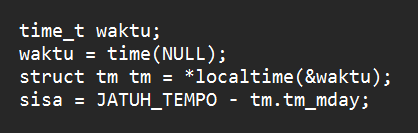
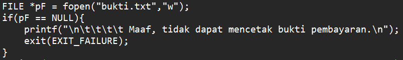

# PENYEMPURNAAN PROGRAM ANGSURAN AIR
_Halo, program ini telah disempurnakan oleh I Kadek Indra Agusta Pratama (saya sendiri), NIM: 2205551056._
 
 
Tugas kali ini adalah menyempurnakan program angsuran air yang telah diberikan dengan cara membuat program yang berisi *syntax* untuk mencetak bukti pembayaran angsuran air. Akan tetapi, sebelum itu, saya juga menambahkan beberapa *syntax* yang seharusnya saya tambahkan pada program sebelumnya. Program yang saya tambahkan adalah program yang berisi *syntax* *local time* untuk menentukkan denda.

## MENENTUKAN DENDA
Denda pada angsuran air dapat ditentukan melalui tanggal dengan *syntax* *local time*. *Syntax* tersebut dapat diakses (dalam bahasa C) melalui *header* yang bernama *time.h*. Berikut adalah *syntax* yang saya gunakan ....
 
 

## MENCETAK BUKTI PEMBAYARAN

Mencetak bukti pembayaran dapat dilakukkan dengan menggunakan *syntax* tipe data FILE yang tedapat dalam bahasa pemorgraman C. Yang pertama dilakukan adalah mendeklarasi sebuah variabel yang berisi *pointer* dengan tipe data FILE, lalu berisi *syntax* fopen untuk menentukkan berkas akan di-*write* atau di-*append*, dan atau perintah lain. Dapat dicetak dengan menggunakan *syntax* fprintf dan memanggil variabel di dalam *syntax* tersebut. Pencetakkan dapat diakhiri dengan fclose. Program dapat dibuat dengan cara seperti ....
 
 

### TERIMA KASIH :)